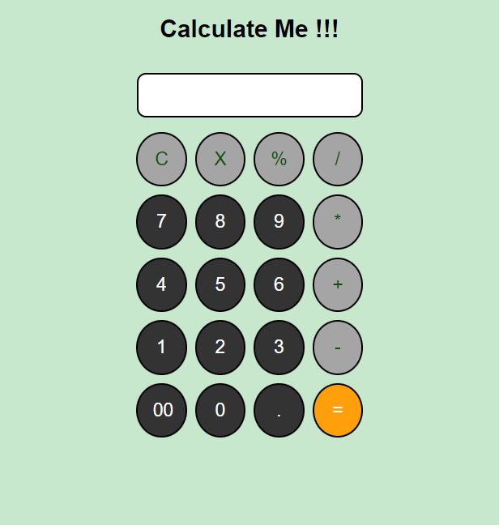

A basic calculator web application built with HTML, CSS, and JavaScript. This project serves as a simple example of front-end development and basic Javascript.

# Features

- Addition, subtraction, multiplication, and division operations.
- Responsive design for various screen sizes.
- Clear button to reset the calculator.

# Screenshots

# Technologies Used

- HTML
- CSS
- JavaScript